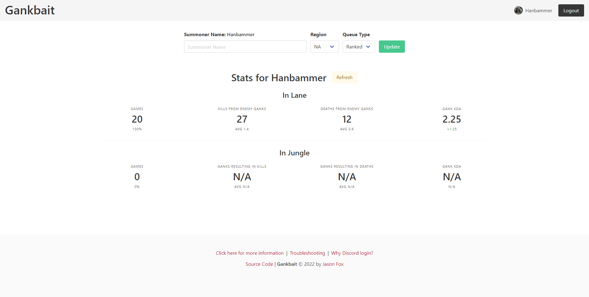

# Gankbait

## 🔗 [Live Site](https://gankbait.jthefox.com)

### Table of Contents
1. [Motivation](#motivation)
2. [Description](#description)
3. [Resources](#resources)
4. [Mock Up](#mock-up)

## Motivation
The name comes from an inside joke that started from something a teammate said when my friend and I were playing [League of Legends](https://www.leagueoflegends.com/en-us/) ranked. In the game, there is a **jungler** role involves constantly traversing the map and can visit and intervene in any of the 3 lanes- this is called **ganking**. Both teams have junglers that can gank, but where and how often depends on the jungler player. When my friend and I play, it often feels like the enemy jungler ganks our lane far more often than ours does. One day, we came with the idea to track ganks on a spreadsheet to see if this bias was true. This gave me an idea to create an app to evaluate related stats from match history with the [Riot API](https://developer.riotgames.com/apis).

## Description 
Gankbait is a single-page application that utilizes the [Riot API](https://developer.riotgames.com/apis) and data processing to produce estimated statistics for a player's [League of Legends](https://www.leagueoflegends.com/en-us/) normal or ranked match history, up to the latest 20 matches. Stats are split between 2 types of roles, jungle and non-jungle. The application allows for a user to set the player to analyze stats for by **summoner name** and **region**, and saves the last result for quick loading when revisiting or refreshing the page. There is also a button to re-analyze player match data from newer games without having to update summoner name.

## Resources
- [Discord OAuth2](https://discord.com/developers/docs/topics/oauth2) for login
- [JSON Web Token](https://jwt.io/) for persistent authentication
- [Express.js](https://expressjs.com/) for server framework
- [Pug](https://pugjs.org/) for page templating
- [Bulma](https://bulma.io/) for styling and easy layout creation
- State management in Vanilla JavaScript for managing display
- REST API for processing data requests
- Third-Party API integration for retrieving player data
- [DynamoDB](https://aws.amazon.com/dynamodb/) for storing user data
- [Dynamoose](https://dynamoosejs.com/) for DynamoDB Object Data Modeling

## Mock Up
 
